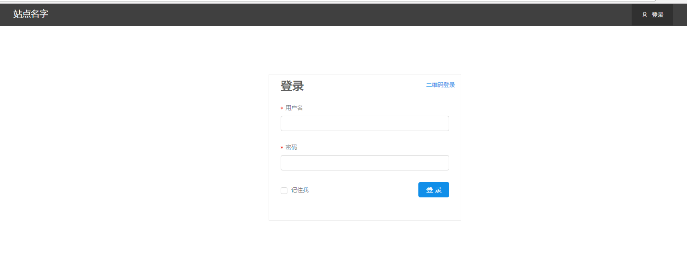
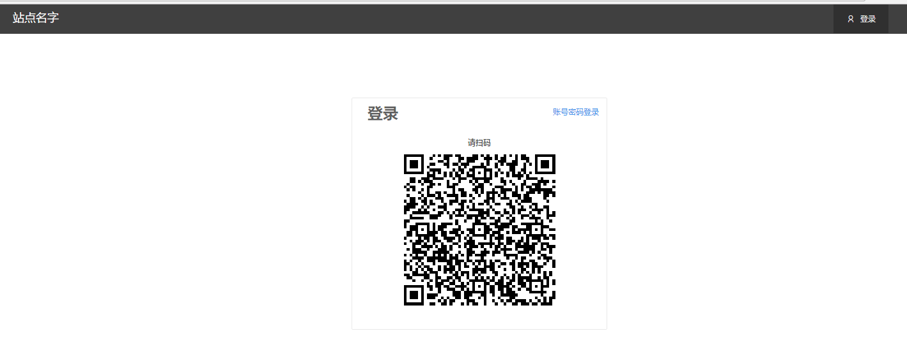
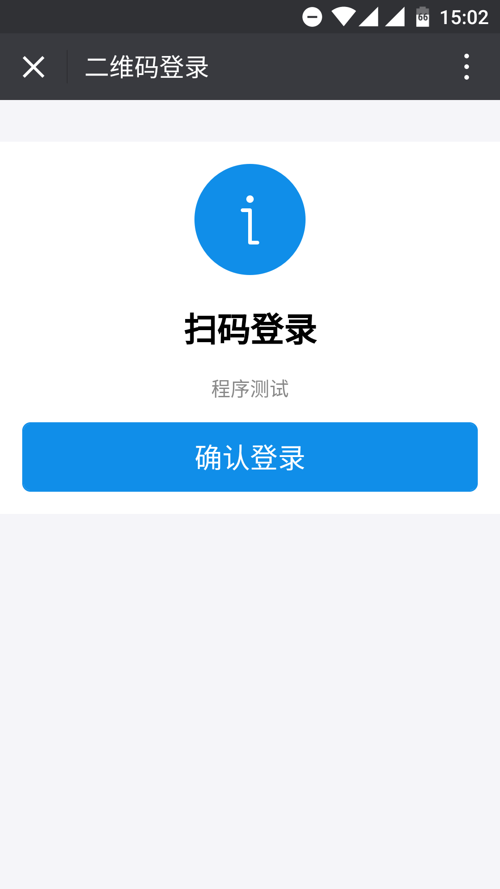
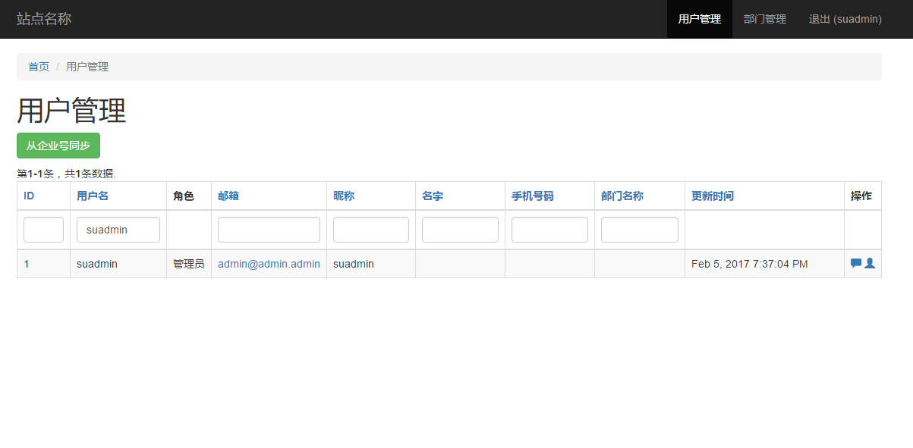

Yii2 应用模板，传统模板
===============================
[](https://packagist.org/packages/purocean/yii2-template)
[](https://travis-ci.org/purocean/yii2-template)
[](https://packagist.org/packages/purocean/yii2-template)
[](https://packagist.org/packages/purocean/yii2-template)
[](https://packagist.org/packages/purocean/yii2-template)

特性
-------------------
+ [x] 微信企业号同步联系人
+ [x] 扫码登录
+ [x] 文件上传处理
+ [x] 微信 jssdk

安装
-------------------
```bash
# 仅测试 PHP7.0
composer global require "fxp/composer-asset-plugin:^1.2.0"
composer install --prefer-dist
./init
vim ./common/config/main.php
vim ./common/config/main-local.php
vim ./common/config/params-local.php
./yii migrate # 迁移表结构
./yii rbac/reset-password suadmin <password> # 更改超级管理员密码
./yii serve 192.168.1.108:8080 -t=@application/web # 运行开发服务器，IP 为本机局域网 IP，以便手机访问
```

测试
-------------------
```bash
vim ./common/config/test-local.php
./yii_test migrate
composer exec codecept build
composer exec codecept run
```


截图
-------------------




